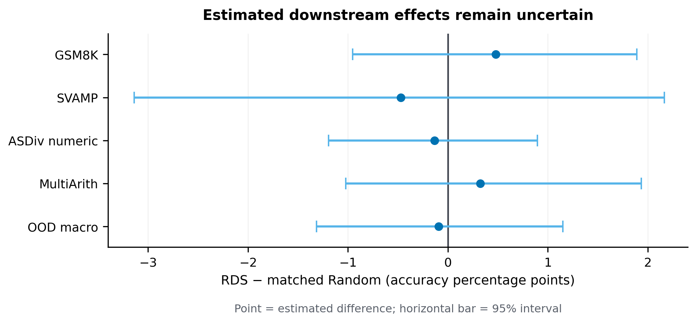
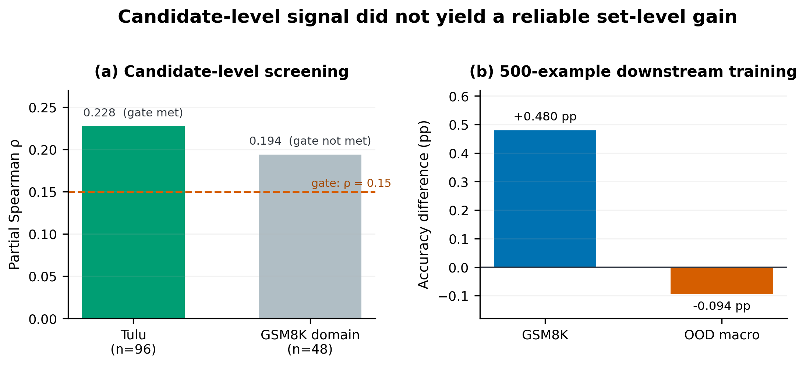
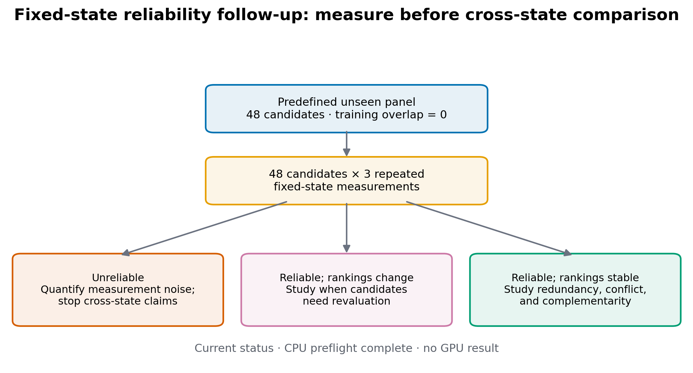

# LLM Post-training Data Selection: A Controlled Study

[中文说明](README_CN.md) · [2-page research snapshot](docs/current/research_snapshot_2p.pdf) · [Claims and limitations](CLAIMS_AND_LIMITATIONS.md) · [Reproduction guide](REPRODUCE.md) · [Research timeline](docs/research_timeline.md)

## What is the research question?

This project asks a concrete question:

> When the number of training examples, response-supervision tokens, and data composition are held constant, does targeted instruction selection improve post-training more reliably than matched random selection?

**Response-supervision tokens** are the answer tokens that actually contribute to the training loss. They are different from prompt tokens and padding tokens. **Candidate utility** is the reduction in loss on an independent utility set after one standardized update with one candidate example. **State dependence** asks whether the estimated value of the same example changes after the model has already been trained into a different parameter state.

The study focuses on a frozen RDS-based targeted-selection policy, Qwen2.5-1.5B Base, response-only LoRA supervised fine-tuning, and arithmetic reasoning tasks. It is a controlled study of this setting—not a general verdict on all data-selection methods.

## Research at a glance

- **Completed:** 24 budget-equivalent LoRA SFT cells with separate cell-level audits.
- **Main result:** no reliable accuracy advantage for targeted RDS over matched Random in the tested setting.
- **Open problem:** a limited one-step candidate signal did not translate into a stable set-level gain.
- **Frozen next step:** test candidate-utility reliability at one fixed model state before any cross-state comparison.
- **Near-term study:** a four-week reliability module covering measurement repeatability, state transfer, and a preregistered stop/go decision.

## What has been completed?

The main completed block contains 24 separately executed training and evaluation cells, each checked by a cell-level audit:

```text
2 selection methods × 4 frozen list realizations per method × 3 training seeds
= 24 cells
```

Each list contains exactly 500 examples. The RDS lists were generated under distinct query-bootstrap seeds, while the Random lists used distinct selection seeds. The targeted lists overlap substantially, so their effective independence is lower than the nominal count of four; training seeds do not create additional selection policies. The targeted and matched-random conditions use the same model, LoRA configuration, optimizer protocol, number of examples, response-supervision budget, and source × answer-length composition. Every completed cell includes the frozen configuration, selected-example manifest, training log, adapter save/reload evidence, raw generations, parsed metrics, and a separate audit result.

Before this block, the project also measured one-step candidate utility on 96 Tulu candidates and ran a 48-candidate GSM8K-domain boundary check. The Tulu experiment passed its original preregistered screening gate; the domain-boundary check did not. These are candidate-level measurements and are not themselves evidence of downstream set-level improvement.

## What are the main results?

The canonical numbers below are generated from [`results/public_summary/main_results.json`](results/public_summary/main_results.json). Positive values favor targeted RDS selection.

| Evaluation metric | RDS minus Random | 95% interval | Current judgment |
|---|---:|---:|---|
| GSM8K exact numeric accuracy | +0.480 percentage points | [-0.954, +1.889] | Insufficient evidence |
| Mean accuracy over three out-of-domain tasks | -0.094 percentage points | [-1.316, +1.149] | Insufficient evidence |



The current experiment did not find a reliable accuracy improvement for RDS over matched Random. However, both intervals include practically relevant positive and negative effects, so the results also do not establish that RDS is ineffective or that the methods are equivalent. The conclusion applies only to the current model, training budget, candidate pool, and arithmetic-task evaluation.

The three out-of-domain tasks are SVAMP, ASDiv numeric, and MultiArith. Their individual results and the seed-resampled sensitivity analysis are available in the canonical JSON and generated CSV rather than being duplicated throughout the documentation.

## What do the results mean?

The project found a gap between a local screening signal and downstream training performance. On the Tulu candidate pool, the error-conditioned score had a partial Spearman correlation of 0.228 with one-step utility and a one-sided permutation value of 0.073 under the original gate. The GSM8K-domain boundary check did not pass that gate. More importantly, the limited Tulu signal did not become a stable gain when 500 selected examples were trained together.



This gap matters because selecting examples one at a time and training on a set of examples are different problems. At least three explanations remain open:

1. candidate utility may be too noisy to measure reliably;
2. an example's value may change as the model's parameters change during training;
3. individually useful examples may become redundant, conflicting, or complementary when combined.

The project also tested a frozen response-composition explanation for a strict-format behavior difference. No feature passed the prespecified source-sensitivity and multiplicity gates, so that branch was stopped without additional GPU retraining. This is a negative mechanism audit, not evidence that formatting can never matter.

## What remains uncertain?

The completed evidence does not establish any of the following:

- that RDS is generally ineffective;
- that RDS and Random are equivalent;
- that error conditioning supplies incremental information over an all-query policy;
- that candidate utility is reliable across repeated measurements;
- that state dependence caused the downstream result;
- that a local probe at a final adapter reconstructs the historical optimizer trajectory.

The 24 cells are a controlled pilot for one model and one supervision budget. Broader model-scale, task-family, budget, and external-selector conclusions require new confirmatory experiments.

## What is the next experiment?

The next stage first checks whether candidate utility can be measured consistently at a fixed model state. Only if that measurement is reliable will the project compare value rankings between the standardized zero-LoRA state and completed LoRA adapter states.

```text
Fixed-state measurement is unreliable
→ study and reduce utility-measurement uncertainty

Fixed-state measurement is reliable, but rankings change after training
→ study when examples need to be revalued

Fixed-state measurement is reliable and rankings remain stable
→ study redundancy, conflict, and complementarity within training sets
```



**Fixed-state reliability follow-up: CPU contracts, panel freezing, overlap checks, and preflight are complete; GPU qualification and formal measurements have not started.** The predefined panel contains 48 candidates that are unseen by all four initial target adapters. Fourteen candidates with direct training exposure were removed before the panel was fixed.

## How can the results be verified?

For the lightweight public checks:

```bash
python -m pip install -e ".[dev]"
python scripts/reproduce_public_summary.py --check
python scripts/verify_public_release.py
python -m pytest -q
python -m ruff check .
```

The first command after installation recomputes the public summary from the audited evidence and checks it against the committed JSON, CSV, and Markdown table. The release verifier checks required files, evidence hashes, README numbers, current-versus-historical labeling, secrets, local absolute paths, restricted artifacts, and Markdown links. See [`REPRODUCE.md`](REPRODUCE.md) for scopes, expected outputs, and the difference between CPU verification and GPU reproduction.

Large raw generations, adapter weights, cloud credentials, and restricted dataset text are not committed. Public evidence contains permitted aggregates, IDs, hashes, frozen configurations, and audit records.

## Repository structure

```text
configs/frozen/          Frozen public research configurations
docs/current/            Current research description and protocols
docs/history/            Earlier stages, explicitly marked as historical
figures/                 Figures generated from public summary data
results/public_summary/  Canonical results and audited evidence
src/                     Reusable Python implementation
scripts/                 Experiment, analysis, and verification entry points
tests/                   CPU tests and small licensed fixtures
workflow/                Stage contracts and audit workflow
releases/                Release-specific manifests and historical notes
```

[`docs/research_timeline.md`](docs/research_timeline.md) explains why each research branch continued or stopped. [`docs/decision_log.md`](docs/decision_log.md) records the evidence, decision, alternatives, and claim restrictions at major checkpoints. [`docs/code_map.md`](docs/code_map.md) maps research questions to code and artifacts.

## Limitations and AI assistance

The main limitations are the single model family and scale, one 500-example budget, a single candidate pool, arithmetic-focused evaluation, highly overlapping targeted-list replicates, and the absence of completed fixed-state reliability measurements. The internal [experiment-integrity audit](EXPERIMENT_AUDIT.md) remains WARN because raw cell generations and adapters are not stored in Git and no independent external reviewer backend was available. Full claim boundaries are listed in [`CLAIMS_AND_LIMITATIONS.md`](CLAIMS_AND_LIMITATIONS.md).

LLM tools contributed substantially to code scaffolding, debugging, documentation, and adversarial review. The project owner selected the research questions, authorized protocol freezes and executions, inspected evidence, accepted or rejected research branches, and is responsible for the reported claims. This repository does not describe all code as independently authored without AI. See [`AI_ASSISTANCE.md`](AI_ASSISTANCE.md) for the detailed disclosure.
